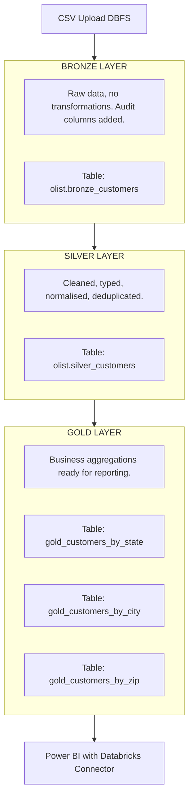
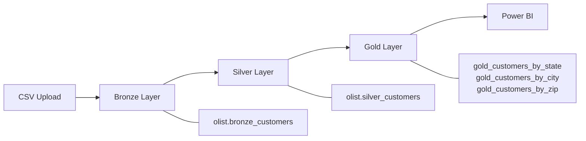

# Olist Customers — Medallion Architecture on Databricks

> A Bronze → Silver → Gold data pipeline built on Databricks, using Delta Lake
> and PySpark, with Power BI as the consumption layer.

**Scope note:** this pipeline currently covers the `customers` table from the
Olist dataset only. <!-- TODO: if your capstone also ingests orders,
order_items, payments, etc., say so here and rename this section
accordingly — a multi-table Medallion pipeline is a much stronger portfolio
signal than a single-table one. If customers is genuinely the full scope,
leave this note as-is or relabel the project "Phase 1" to set expectations. -->

---

## Project Structure

```
olist-medallion/
├── notebooks/
│   ├── 01_bronze_ingest.py      # Raw ingestion from CSV → Delta
│   ├── 02_silver_clean.py       # Cleaning, typing, deduplication
│   ├── 03_gold_agg.py           # Business aggregations for Power BI
│   └── 04_validate.py           # Cross-layer data quality checks
├── data/
│   └── olist_customers_dataset.csv   # Source file (upload to DBFS manually)
└── README.md
```

---

## Dataset

| Field | Type | Description |
|---|---|---|
| `customer_id` | string | Unique order-level customer ID |
| `customer_unique_id` | string | Unique person-level customer ID |
| `customer_zip_code_prefix` | integer | First 5 digits of ZIP code |
| `customer_city` | string | Customer city name |
| `customer_state` | string | Brazilian state abbreviation (e.g. SP, RJ) |

**Source:** [Olist Brazilian E-Commerce Dataset](https://www.kaggle.com/datasets/olistbr/brazilian-ecommerce)
**Size:** ~99,441 rows

---

## Architecture Overview



## Simplified Version



---

## Design Decisions

A few choices worth calling out rather than leaving implicit:

- **Databricks + Delta Lake over Azure ADF/Synapse:** chosen here for the
  built-in Spark runtime, ACID transactions on write, and free-tier
  accessibility for a self-contained demo pipeline.
  <!-- TODO: replace/extend with your actual reasoning if different —
  e.g. if this was a DEPI capstone requirement rather than an open choice,
  say that instead. -->
- **Delta Lake over plain Parquet:** gives schema enforcement, time travel,
  and `MERGE`/upsert support out of the box — relevant even though this
  version currently does full overwrites (see Limitations below).
- **Medallion (Bronze/Silver/Gold) over a single flat transform:** keeps raw
  data auditable (Bronze), separates cleaning logic from business logic, and
  lets Gold tables stay narrow and query-optimized for BI tools.

---

## Layer Details

### Bronze — Raw Ingestion (`01_bronze_ingest.py`)

**Goal:** Land the source data into Delta Lake exactly as-is. Never modify source columns at this layer.

**What it does:**

- Reads the CSV from DBFS (`/FileStore/tables/olist_customers_dataset.csv`)
- Adds two audit columns: `_ingested_at` (timestamp) and `_source_file` (filename)
- Writes to `olist.bronze_customers` as a managed Delta table

**Nothing is cleaned here.** If the source has nulls, bad types, or duplicate rows — Bronze keeps them. This is intentional: Bronze is your audit trail.

---

### Silver — Cleaning & Typing (`02_silver_clean.py`)

**Goal:** Make the data trustworthy and queryable. Silver is the single source of truth for analysts.

**What was handled:**

| Problem | How it was fixed |
| --- | --- |
| `customer_zip_code_prefix` stored as string | Cast to `IntegerType()` |
| City names with inconsistent casing (`"São Paulo"`, `"sao paulo"`, `"SAO PAULO"`) | `F.lower(F.trim(...))` applied to `customer_city` |
| State names with inconsistent casing | `F.upper(F.trim(...))` applied to `customer_state` |
| Leading/trailing whitespace in text fields | `F.trim()` applied to city and state |
| Rows missing `customer_id` or `customer_unique_id` | Dropped via `dropna(subset=[...])` |
| Duplicate rows on `customer_id` | Removed via `dropDuplicates(["customer_id"])` |

A `_cleaned_at` audit timestamp is added.

**Data quality results (Bronze → Silver):**

| Metric | Value |
| --- | --- |
| Bronze row count | 99,441 |
| Silver row count | 99,441 |
| Rows dropped (nulls) | 0 |
| Rows dropped (duplicates) | 0 |
| Retention rate | 100.00% |

The source dataset arrived clean at the customer level — no null `customer_id`/`customer_unique_id` and no duplicate `customer_id` rows were present in Bronze, so Silver's row count matches Bronze exactly. The dedup/null-drop logic still runs on every execution and is verified in `04_validate.py`, so the pipeline is defensive against dirtier future loads even though this run didn't need to remove anything.

---

### Gold — Business Aggregations (`03_gold_agg.py`)

**Goal:** Pre-aggregate data into reporting-ready tables. Power BI reads these directly — no heavy computation at query time.

**Table 1 — `gold_customers_by_state`**

Answers: *How many customers does each state have? What's the repeat purchase rate?*

| Column | Description |
| --- | --- |
| `customer_state` | State abbreviation |
| `total_customers` | Count of all customer records |
| `unique_customers` | Count of distinct `customer_unique_id` (person-level) |
| `distinct_cities` | How many cities are represented in that state |
| `repeat_customer_rate` | `1 - (unique / total)` — proportion of repeat buyers |

**Table 2 — `gold_customers_by_city`**

Answers: *Which cities drive the most customers, broken down by state?*

| Column | Description |
| --- | --- |
| `customer_state` | State abbreviation |
| `customer_city` | Normalised city name |
| `total_customers` | Customer count in that city |
| `unique_customers` | Distinct person-level count |

**Table 3 — `gold_customers_by_zip`**

Answers: *Where are customers geographically concentrated? (for map visuals)*

| Column | Description |
| --- | --- |
| `customer_zip_code_prefix` | 5-digit ZIP prefix |
| `customer_state` | State |
| `total_customers` | Customer count in that ZIP zone |

---

### Validation — Data Quality Checks (`04_validate.py`)

**Goal:** Confirm each layer transition preserved data integrity before it reaches Power BI.

**What it checks:**

- Bronze row count matches the raw CSV row count (ingestion completeness)
- Silver row count + dropped-row count reconciles back to Bronze row count
- No nulls in `customer_id` or `customer_unique_id` post-Silver
- No duplicate `customer_id` values post-Silver
- Gold table `total_customers` sums reconcile back to Silver row count per grouping

<!-- TODO: confirm this list matches what 04_validate.py actually asserts —
add/remove lines so the README matches the real checks, and consider
having the notebook print a pass/fail summary table so the results are
visible when someone runs it. -->

---

## Limitations & Next Steps

Being upfront about these signals engineering maturity rather than hiding them:

- **Full overwrite, not incremental.** Bronze/Silver/Gold writes currently
  overwrite in full on each run rather than using `MERGE` for
  upserts. Fine for a demo/batch dataset that doesn't change; a production
  version would use Delta `MERGE` or a CDC pattern for incremental loads.
- **Manual ingestion.** The CSV is uploaded to DBFS by hand. A production
  pipeline would replace this with Databricks Auto Loader or a scheduled
  pull from a source system.
- **Single-table scope.** See the scope note at the top — extending this to
  join `orders`, `order_items`, and `payments` would unlock richer Gold
  metrics (e.g. revenue per state, not just customer counts).
- **No orchestration.** Notebooks are run manually in sequence. A next step
  would be wrapping this in a Databricks Job or Airflow DAG with
  dependencies and failure alerting.

---

## How to Run

### Prerequisites

- Databricks account (free tier works)
- Cluster running (Runtime 12+ / Spark 3.3+)
- CSV uploaded to DBFS: `Data > Add Data > Upload File`

### Execution Order

```bash
# Run notebooks in this exact order — each depends on the previous Delta table
01_bronze_ingest.py   →   02_silver_clean.py   →   03_gold_agg.py   →   04_validate.py
```

### Database Setup (run once before anything)

```python
spark.sql("CREATE DATABASE IF NOT EXISTS olist")
```

---

## Power BI Connection

1. Open **Power BI Desktop** → Get Data → **Databricks**
2. Enter your **Server hostname** (Compute → your cluster → Advanced Options → JDBC/ODBC)
3. Enter your **HTTP path** (same panel)
4. Authentication: **Personal Access Token**
   - Databricks → Settings → Developer → Access Tokens → Generate New Token
5. In the Navigator, select the three Gold tables under `olist`
6. Click **Load**

### Recommended Visuals

| Visual Type | Table | Fields |
|---|---|---|
| Bar chart | `gold_customers_by_state` | state vs total_customers |
| KPI card | `gold_customers_by_state` | repeat_customer_rate |
| Map | `gold_customers_by_zip` | zip_prefix (location) + total_customers |
| Treemap | `gold_customers_by_city` | city + total_customers, sliced by state |

### Dashboard Preview


---

## Git Integration (Databricks → GitHub)

See **"Pushing to GitHub"** section below for full step-by-step instructions.

---

## Tech Stack

| Tool | Purpose |
|---|---|
| Databricks (free tier) | Compute, notebook authoring, cluster |
| Apache Spark / PySpark | Distributed data processing |
| Delta Lake | ACID-compliant storage format |
| DBFS | Distributed file system for CSV landing |
| Power BI Desktop | Business intelligence and reporting |
| GitHub | Version control for notebooks |

---

## Author

**Jimmy**
